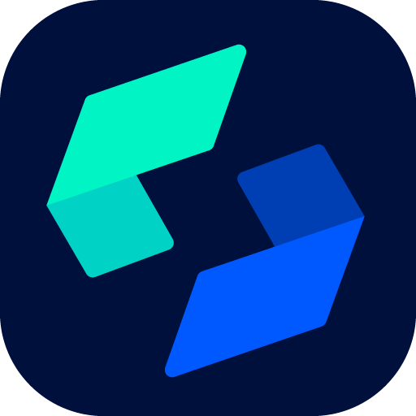

# Laravel Uploads

<p align="center">
  
</p>

<p align="center">
  
  
  
</p>

Laravel Uploads stores files through Laravel Storage, tracks upload metadata, generates secure private file URLs, supports public disk URLs, integrates with Eloquent models, and can optionally optimize browser images.

## Install

```bash
composer require ghostcompiler/laravel-uploads
php artisan ghost:laravel-uploads
php artisan migrate
```

Use `--force` to overwrite already-published config or migration files:

```bash
php artisan ghost:laravel-uploads --force
```

By default, files are stored under `LaravelUploads` on the configured disk.

## Basic Upload

```php
use GhostCompiler\LaravelUploads\Facades\Uploads;

$upload = Uploads::upload($request->file('avatar'));

$upload = Uploads::upload('avatars', $request->file('avatar'));
```

Store the upload ID on your model:

```php
$user->avatar_id = $upload->id;
$user->save();
```

Delete an upload:

```php
Uploads::remove($user->avatar_id);
```

The helper uses the same service:

```php
$upload = GhostCompiler()->upload('avatars', $request->file('avatar'));
```

## Model URLs

Add upload ID columns such as `avatar_id`, `document_id`, or `favicon_id` to your own models.

```php
use GhostCompiler\LaravelUploads\Concerns\LaravelUploads;
use Illuminate\Foundation\Auth\User as Authenticatable;

class User extends Authenticatable
{
    use LaravelUploads;

    protected $uploadable = [
        'avatar_id' => [
            'name' => 'avatar',
            'id' => 'hide',
            'expiry' => 60,
            'expose' => true,
        ],
    ];
}
```

Now `$user->avatar` returns the file URL. In array or JSON responses, URL fields are only included when `expose` is `true`.

Customize returned values when needed:

```php
public function setUploadableValue($value)
{
    return $value;
}
```

You can also define a field-specific hook such as `setAvatarUploadableValue($value)`.

## Public And Private URLs

Private uploads generate package URLs like:

```text
https://your-app.test/_laravel-uploads/file/{token}
```

Public uploads return the disk URL directly and do not create or regenerate `laravel_uploads_links` rows:

```php
$upload = Uploads::upload('avatars', $request->file('avatar'), [
    'visibility' => 'public',
]);
```

For multi-tenant apps where each tenant has a different domain, register a public URL resolver:

```php
use GhostCompiler\LaravelUploads\Facades\Uploads;

public function boot(): void
{
    Uploads::resolvePublicUrlsUsing(function ($upload, $disk, $path) {
        $tenant = tenant();

        return "https://{$tenant->domain}/storage/{$path}";
    });
}
```

You can also configure a resolver class:

```php
'urls' => [
    'public_resolver' => App\Support\TenantUploadUrlResolver::class,
],
```

```php
class TenantUploadUrlResolver
{
    public function publicUrl($upload, $disk, string $path): string
    {
        return 'https://'.tenant()->domain.'/storage/'.$path;
    }
}
```

Force a private file download with `?download=1`.

## Favicon Uploads

Use the normal upload API and pass `favicon` only when the upload should be treated as a favicon:

```php
$upload = Uploads::upload('favicons', $request->file('favicon'), [
    'favicon' => true,
]);
```

Existing `.ico` files are stored without conversion. JPEG, PNG, and WEBP uploads are converted into a square favicon PNG.

## Other Useful APIs

Upload multiple files:

```php
$uploads = Uploads::uploadMany($request->file('documents'), 'documents');
```

Allow specific excluded extensions only when you explicitly need it:

```php
$upload = Uploads::upload($request->file('script'), ['sh', 'rb']);
```

Critical extensions in `validation.never_allowed_extensions`, such as `php`, `phar`, and `phtml`, cannot be allowed with this override.

Clean expired private URL tokens:

```bash
php artisan ghost:laravel-uploads-clean
php artisan ghost:laravel-uploads-clean --dry-run
```

## Image Optimization

Image optimization is disabled by default.

```php
'image_optimization' => [
    'enabled' => true,
    'strict' => false,
    'quality' => 75,
    'convert_to_avif' => true,
    'max_width' => 1600,
    'max_height' => null,
]
```

When enabled, supported JPEG, PNG, and WEBP uploads try AVIF first and fall back to WEBP. Resizing preserves aspect ratio and never upscales.

## Configuration

Important config keys:

- `disk`: Laravel disk used for storage.
- `base_path`: base folder inside the disk.
- `defaults.visibility`: default `private` or `public` visibility.
- `defaults.expiry`: private URL expiry in minutes.
- `defaults.expose`: whether model serialization appends URL fields by default.
- `cache.enabled`: reuse private generated URLs until expiry.
- `validation.max_size`: max upload size in bytes.
- `validation.allowed_mime_types`: optional server-detected MIME allowlist.
- `validation.allowed_extensions`: optional extension allowlist.
- `validation.excluded_mime_types`: blocked MIME types.
- `validation.excluded_extensions`: blocked extensions.
- `validation.never_allowed_extensions`: critical extensions that cannot be overridden.
- `image_optimization.*`: image conversion and resize limits.
- `favicon.size`: favicon output size.
- `downloads.use_original_name`: use original filename in download headers.
- `urls.public_resolver`: optional tenant/CDN resolver for public upload URLs.
- `preview_mime_types`: MIME types allowed to open inline.
- `delete_files_with_model`: delete stored files when the model is deleted.
- `route.*`: package file-serving route settings.

Full local development, path repository, validation, and security notes live in [DEVELOPER.md](DEVELOPER.md).

## Security Defaults

- Upload paths are normalized and reject traversal such as `..`.
- MIME validation uses server-side detection.
- SVG is downloaded by default instead of previewed inline.
- Model URL exposure is opt-in through `expose`.
- Public uploads use the disk URL directly.
- Private uploads use expiring package tokens.

## Development And Build Environment

This package was developed using **ServBay** as the local development environment.

### Development Tool Used

- Local development tool: `ServBay`
- Website: [www.servbay.com](https://www.servbay.com/)

### ServBay your development friend

<p>
  
</p>

### Testing And Build Machine

- Tested on: `Mac M4`
- Built on: `Mac M4`
